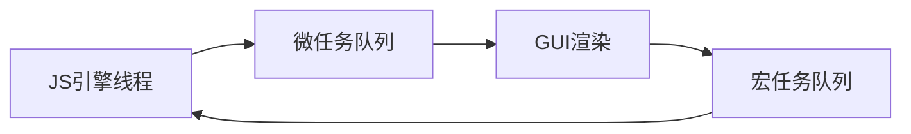

# 事件环`Event loop`

## 概念

从`JavaScript`执行机制开始。


## 进程

一个`cpu`进程，为了任务正常运行分配调度出一个单位，来供其运行一个任务，进程是计算机调度的基本单位，**进程包含多个线程，线程在进程中运行**。区分进程的原因是各自完成独立的工作，降低耦合，让进程之间不存在相互影响。


**在浏览器中的进程：**

它是由多个进程组成的应用程序，分为主进程和辅助进程，每个`tab`页都会开启一个进程。

- 主进程：专门来渲染用户界面。
- `tab`页：
  - 渲染进程(浏览器内核`Renderer`渲染引擎)
  - 网络进程(网络请求)
  - `GPU`进程(动画与`3D`绘制)
  - 插件工具进程(`devtool`)


**渲染进程：**

它包括`GUI`渲染线程(渲染页面)和`JS`引擎线程(处理`JS`脚本程序)，两者线程运行互斥。在渲染的过程中，`JS`在改变DOM是会产生冲突。

- 当`JS`引擎线程工作的时候，`GUI`渲染线程(有队列)会空闲停止工作。
- 当`JS`引擎线程工作完成时，`GUI`渲染线程(有队列)会继续工作，渲染更新。


## 线程

**在渲染进程中的`GUI`渲染线程：**

- 解析`HTML,CSS`
- 构建`DOM/render`树
- 初始布局与绘制
- 重绘与回流


**在渲染进程中的`JS`内核引擎线程：**

- 一个主线程与多个辅助线程配合。
- 一个浏览器只有一个`JS`引擎，只有一个主线程。
- 解析`JS`脚本，运行`JS`代码。


**在渲染进程中的事件触发线程：**

事件触发线程即事件环`Event Loop`线程

- 用户交互事件
- `setTimeout`
- `Ajax`


## 宏任务与微任务

宏任务是浏览器规定的一些 `WebAPIs`，而微任务是`ES6`语法规定的，如`promise.then()`。

**在渲染进程中的宏任务和微任务：**

创建线程的目的是**为了实现异步的执行条件**。区分宏任务和微任务主要是实现优先级的问题，微任务实际上是优先级要高于宏任务，每一次微任务在执行队列里的任务执行完毕后要清空微任务当前任务队列，也就是先对微任务进行处理，然后去渲染，去执行宏任务。


***为什么`Promise.then`要优先于下一个宏任务去处理？***

因为它跟后续的代码也是保持异步关系，处理`Promise`，微任务去处理`Promise`的`then`回调。


> 注： `Mutation Observer`（变动观察器）是监视`DOM`变动的接口。当`DOM`对象树发生任何变动时，`Mutation Observer`会得到通知。

  

**宏任务：**

- 宿主提供的异步方法和任务
- `script`整体脚本代码
- `setTimeout UI`渲染

| 宏任务                  | 浏览器 | Node |
| ----------------------- | :----: | ---: |
| `I/O`                   |   ✅    |    ✅ |
| `setTimeout`            |   ✅    |    ✅ |
| `setInterval`           |   ✅    |    ✅ |
| `setImmediate`          |   ❌    |    ✅ |
| `requestAnimationFrame` |   ✅    |    ❌ |

**微任务：**

- 语言标准(`ECMA262`)提供的`API`运行
- `Promise`
- `Mutation Observer`：接口提供了监视对DOM树所做更改的能力

| 微任务                       | 浏览器 | Node |
| ---------------------------- | :----: | ---: |
| `process.nextTick`           |   ❌    |    ✅ |
| `MutationObserver`           |   ✅    |    ❌ |
| `Promise.then catch finally` |   ✅    |    ✅ |


## 流程



**事件环的运行流程简述：**

首先执行同步代码，宏任务异步代码进入执行栈是有条件的，如`Ajax`有响应了，或者定时器到时间了，或者用户事件被触发时就把宏任务中的回调函数放进执行栈。一次事件轮询只能进入一次执行栈。宏任务队列遵循先进先出的原则，前提是Ajax或定时器或用户事件满足了条件。

当执行栈里的同步代码和宏任务代码执行完毕后，会查看微任务队列里是否存在内容，如`Promise.then`的回调函数是否处理完毕，每次执行确保微任务队列里所有的任务一次性的清空，区别于宏任务的逐一推入执行。

微任务执行完毕后会到`GUI`渲染。`GUI`渲染完毕时又去宏任务队列取出一个满足条件的回调函数推入执行栈。执行栈代码执行完毕又去微任务队列中查找是否有任务，有微任务的原因是在宏任务里可能有定义微任务如`Promise.then`。接着清空微任务，再去`GUI`渲染，再去宏任务，一直轮询。

1. `JS`引擎线程(执行栈)：

   - 同步代码
   - 宏任务异步代码
2. 微任务队列(**清空所有**)：

   1. `Promise.then`

   2. `Mutation Observer`：接口提供了监视对DOM树所做更改的能力
3. `GUI`渲染
4. 触发`Event Loop`，检查宏任务队列(取出**一个**放入执行栈，先进先出)：

   - `Ajax`(响应回来进执行栈)
   - `setTimeout`(时间到了进执行栈)
   - 用户交互事件(事件被触发进执行栈)
5. `JS`引擎线程(接收异步的**回调**)...


**代码分析：**

```js
//宏任务: script脚本
document.body.style.backgroundColor = 'orange';
console.log(1);

//宏任务: setTimeout
//微任务: setTimeout里的回调
setTimeout(() => {
  document.body.style.backgroundColor = 'green';
  console.log(2);
}, 100);

//微任务: then里的回调
Promise.resolve(3).then(num => {
  document.body.style.backgroundColor = 'pink';
  console.log(num);
});

//宏任务: script脚本
console.log(4)
```

> **注意：**
>
> 关于`Promise`，它是根据后面是否跟有`then`来决定是否进入微任务队列的。微任务队列和宏任务队列是不同的，微任务队列叫`queueMicrotask`，而宏任务队列是回调队列。
>
> - 如果没有跟`then`，它是同步关系，不会进入微任务队列，不会挂起。
> - 如果有跟`then`，它是异步关系，会进入微任务队列，会挂起。

```
//代码流程:
JS引擎线程执行栈：
  1. script脚本 document.body.style.backgroundColor = 'orange'; 没渲染
  2. script脚本 console.log(1);  //1
  3. script脚本 console.log(4);  //4 
  ⬇  
  
微任务队列queueMicrotask：
  4. 执行Promise.resolve(3).then()里面的回调;
  5. document.body.style.backgroundColor = 'pink';
  6. console.log(num); //3
  7. 清空微任务队列
  ⬇  
  
GUI渲染; //backgroundColor = 'pink'; 渲染成功
  ⬇  
  
宏任务队列：
  8. setTimeout(); 根据延迟时间到点决定是否放入队列
  9. setTimeout(cb); 将回调放入JS执行栈
  ⬇ 
  
JS引擎线程执行栈：
  10. 去执行回调 document.body.style.backgroundColor = 'green'; 没渲染
  11. 去执行回调 console.log(2);  //2
  ⬇ 

微任务队列：已清空
  ⬇ 
  
GUI渲染; //backgroundColor = 'green'; 渲染成功
  ⬇ 
  
宏任务队列：空
  ⬇ 
  
JS引擎线程执行栈：空
```


***为什么宏任务和微任务都要滞后(异步)？***

都是为了模拟一个多线程，跟同步代码是滞后关系。


## 练习

**题目1：**

```js
Promise.resolve().then(() => {
  console.log('p1');
  
  setTimeout(() => {
    console.log('s2');
  }, 0);
});

setTimeout(() => {
  console.log('s1');
  Promise.resolve().then(() => {
    console.log('p2');
  });
}, 0);
```

```
//代码流程:
JS引擎线程执行栈执行同步宏任务代码。
1. 整体script代码
2. 执行Promise.resolve()，发现是一个微任务，注册微任务promise1在微任务队列queueMicrotask里。
3. 执行setTimeout(), 发现是一个宏任务，注册宏任务setTimeout1在回调队列里。

执行栈执行完毕后去微任务队列里查看是否存在任务，必须清空任务。
4. 目前只有一个任务是promise1.then(cb)，并将其回调函数放入执行栈去执行。打印p1。
5. 发现一个宏任务，注册宏任务setTimeout2在回调队列里，清空当前微任务队列。
6. 进行GUI渲染。

查看宏任务队列。
7. 将setTimeout1回调函数推入执行栈，执行栈执行，打印s1。
8. 发现一个微任务，注册微任务promise2在微任务队列queueMicrotask里。setTimeout1执行完毕。

查看微任务队列里查看是否存在任务，必须清空任务。
9. 目前只有一个任务是promise2.then(cb)，并将其回调函数放入执行栈去执行。打印p2。
10. 进行GUI渲染。

查看宏任务队列。
11. 将setTimeout2回调函数推入执行栈，执行栈执行，打印s2。
```


**题目2：**

```js
console.log(1);

setTimeout(() => {
  console.log(2);
}, 10);

new Promise(function(resolve, reject){
  console.log(3);
  resolve('');
  console.log(4);
}).then(res => {
  console.log(5);
});
console.log(6);
```

```
//代码流程:
JS引擎线程执行栈执行同步宏任务代码。
1. 整体script代码, 打印1
2. 执行setTimeout(), 发现是一个宏任务，注册宏任务setTimeout1在回调队列里。
3. 执行new Promise()，打印3，抛出''，打印4。链式then是微任务，注册微任务promise1到微任务队列里。
4. 执行同步代码并打印6。 

去微任务队列里查看是否存在任务，必须清空任务。
5. 目前只有一个任务是promise1.then(cb)，并将其回调函数放入执行栈去执行。打印5。
6. 进行GUI渲染。

查看宏任务队列。
7. 将setTimeout1回调函数推入执行栈，执行栈执行，打印2。
```


**题目3：**

```js
console.log(1);

setTimeout(() => {
  Promise.resolve().then(() => {
    console.log(2);
  });
}, 10);

new Promise(function(resolve, reject){
  console.log(3);
  resolve('');
  console.log(4);
}).then(res => {
  setTimeout(() => {
    console.log(5);
  }, 0);
});
console.log(6);
```

```
//代码流程:
JS引擎线程执行栈执行同步宏任务代码。
1. 整体script代码, 打印1
2. 执行setTimeout(), 发现是一个宏任务，注册宏任务setTimeout1在回调队列里。
3. 执行new Promise()，打印3，抛出''，打印4。链式then是微任务，注册微任务promise1到微任务队列里。
4. 执行同步代码并打印6。 

去微任务队列里查看是否存在任务，必须清空任务。
5. 目前只有一个任务是promise1.then(cb)，并将其回调函数放入执行栈去执行。
6. 发现一个宏任务，注册宏任务setTimeout2在回调队列里，清空当前微任务队列。
7. 进行GUI渲染。

查看宏任务队列。
7. 将setTimeout2回调函数推入执行栈，执行栈执行，打印5。

查看微任务队列。并没有任务。
查看宏任务队列。
8. 将setTimeout1回调函数推入执行栈，执行栈执行，发现是一个微任务，注册微任务promise2到微任务队列。

去微任务队列里查看是否存在任务，必须清空任务。
9. 目前只有一个任务是promise2.then(cb)，并将其回调函数放入执行栈去执行。打印2。
10. GUI渲染。
```


**题目4：**

```js
let res = function(){
  console.log(1);
  return new Promise((resolve, reject) =>{
    console.log(2);
    resolve(4);
  });
}

new Promise(async(resolve, reject) => {
  console.log(3);
  let test = await res();
  console.log(test);
});

console.log(5);

new Promise((resolve, reject) => {
  console.log(6);
});
console.log(7);
```

`async`函数是默认返回`promise`实例的，`await`必须存在在`async`函数中。`await` 函数执行会产出一个值，跟生成器函数内`yield`是一样的。`await`函数执行相当于函数名`.then`执行的方式获取结果。

```
//代码流程:
JS引擎线程执行栈执行同步宏任务代码。
1. 整体script代码。function赋值给res。
2. 执行同步代码new Promise(), 打印3，遇到await写法的函数执行，相当于res().then()写法。
3. 首先执行res()。打印1，执行同步代码new Promise()，打印2，抛出4。
4. res()执行完毕后，发现一个微任务，注册微任务awaitPromise1到微任务队列里。
5. 执行同步代码并打印5。 
6. 执行执行new Promise()，打印6。
7. 执行同步代码7。

去微任务队列里查看是否存在任务，必须清空任务。
8. 目前只有一个任务是promise1.then(cb)，并将其回调函数放入执行栈去执行。
9. 打印微任务回调里的代码，打印4。清空微任务队列。
10. 进行GUI渲染。
```

**题目5：**

```js
let res = function(){
  console.log(1);
  return new Promise((resolve, reject) =>{
    setTimeout(() => {
      new Promise((resolve) => {
        console.log(2);
        setTimeout(() => {
          console.log(3);
        });
      });
    }, 0);
    resolve(5);
  });
}

new Promise(async(resolve, reject) => {
  setTimeout(() => {
    Promise.resolve().then(() => console.log(4));
  }, 0);
  
  let test = await res();
  console.log(test);
});

setTimeout(() => {
  console.log(6);
});

new Promise((resolve, reject) => {
  setTimeout(() => {
    console.log(7);
  }, 0);
});
console.log(8);
```

```
//代码流程:
JS引擎线程执行栈执行同步宏任务代码。
1. 整体script代码。function赋值给res。
2. 执行同步代码new Promise(), 发现一个宏任务，注册宏任务setTimeout1在回调队列里。
3. 遇到await写法的函数执行，相当于res().then()写法。首先执行res()。打印1，执行同步代码new Promise()，发现一个宏任务，注册宏任务setTimeout2在回调队列里。抛出5。
4. res()执行完毕后，发现一个微任务，注册微任务aw aitPromise1到微任务队列里。
5. 发现一个宏任务，注册宏任务setTimeout3在回调队列里。
6. 执行new Promise()，发现一个宏任务，注册宏任务setTimeout4在回调队列里。
7. 执行同步代码并打印8。

去微任务队列里查看是否存在任务，必须清空任务。
8. 目前只有一个任务是promise1.then(cb)，并将其回调函数放入执行栈去执行。
9. 打印微任务回调里的代码，打印5。微任务队列清空。
10. 进行GUI渲染。

查看宏任务队列。
11. 将setTimeout1回调函数推入执行栈，执行栈执行，执行Promise.resolve()，发现一个微任务，注册微任务promise2到微任务队列里。

查看执行栈代码，没有代码执行。

去微任务队列里查看是否存在任务，必须清空任务。
12. 目前只有一个任务是promise2.then(cb)，并将其回调函数放入执行栈去执行。打印4。清空微任务队列。
13. 进行GUI渲染。

查看宏任务队列。
14. 将setTimeout2回调函数推入执行栈，执行栈执行，执行new Promise()，打印2，发现一个宏任务，注册宏任务setTimeout5在回调队列里。

查看执行栈代码，没有代码执行。

去微任务队列里查看是否存在任务，没有任务。

查看宏任务队列。
15.将setTimeout3回调函数推入执行栈，执行栈执行，打印6。

查看执行栈代码，没有代码执行。

去微任务队列里查看是否存在任务，没有任务。

查看宏任务队列。
16.将setTimeout4回调函数推入执行栈，执行栈执行，打印7。

查看执行栈代码，没有代码执行。

去微任务队列里查看是否存在任务，没有任务。

查看宏任务队列。
17.将setTimeout5回调函数推入执行栈，执行栈执行，打印3。
```

题目6

```js
setTimeout(() => {
  console.log('setTimeout1');
  setTimeout(() => {
    console.log('setTimeout3');
  }, 1000);
  Promise.resolve().then((data) => {
    console.log('then3');
  });
}, 1000);

Promise.resolve().then((data) => {
  console.log('then1');
  console.log('then4');
  Promise.resolve().then((data) => {
    console.log('then6');
  });
});

Promise.resolve().then((data) => {
  console.log('then2');
  console.log('then5');
  setTimeout(() => {
    console.log('setTimeout2');
  }, 1000);
});

console.log(2);
```

```
//代码流程:
JS引擎线程执行栈执行同步宏任务代码。
1. 整体script代码。
2. 发现一个宏任务，注册宏任务setTimeout1在回调队列里。
3. 执行Promise.resolve()，发现微任务，注册微任务promise1到微任务队列里。
4. 执行Promise.resolve()，发现微任务，注册微任务promise2到微任务队列里。
5. 执行打印2。

去微任务队列里查看是否存在任务，必须清空任务。
6. 执行promise1.then(cb)，并将其回调函数放入执行栈去执行。
7. 打印微任务回调里的代码，打印then1，打印then4。
8. 执行Promise.resolve()，发现微任务，注册微任务promise3到微任务队列里。
9. 执行promise2.then(cb)，并将其回调函数放入执行栈去执行。
10. 打印微任务回调里的代码，打印then2，打印then5。发现一个宏任务，注册宏任务setTimeout2在回调队列里。微任务队列清空。
11. 执行promise3.then(cb)，并将其回调函数放入执行栈去执行。打印then6。
12. 进行GUI渲染。

查看宏任务队列。
13. 将setTimeout1回调函数推入执行栈，执行栈执行，打印setTimeout1，发现一个宏任务，注册宏任务setTimeout3在回调队列里。执行Promise.resolve()，发现一个微任务，注册微任务promise4到微任务队列里。

查看执行栈代码，没有代码执行。

去微任务队列里查看是否存在任务，必须清空任务。
14. 执行promise4.then(cb)，并将其回调函数放入执行栈去执行。打印then3。清空微任务队列。
15. 进行GUI渲染。

查看宏任务队列。
16. 将setTimeout2回调函数推入执行栈，执行栈执行，打印setTimeout2。

查看宏任务队列。
17. 将setTimeout2回调函数推入执行栈，执行栈执行，打印setTimeout3。
```

题目7

```js
setTimeout(() => {
  console.log(1);
}, 0);

new Promise((resolve, reject) => {
  console.log(2);
  resolve();
})
  .then(() => {
    console.log(3);
  })
  .then(() => {
    console.log(4);
  });

console.log(6);
```

```
//代码流程:
JS引擎线程执行栈执行同步宏任务代码。
1. 整体script代码。
2. 发现一个宏任务，注册宏任务setTimeout1在回调队列里。
3. 执行new Promise()，打印2。
4. 发现then，注册微任务promise1到微任务队列。
5. 发现then，注册微任务promise2到微任务队列。
6. 打印6。

去微任务队列里查看是否存在任务，必须清空任务。
7. 执行promise1，打印3。
8. 执行promise2，打印4。
9. 清空微任务，进行GUI渲染。

查看宏任务队列。
10. 打印1。
```

题目8

```js
console.log(1);
//setTimeout1
setTimeout(() => {
  console.log(2);
  new Promise((resolve) => {
    console.log(3);
    resolve();
  }).then(() => {
    //promise3
    console.log(4);
  });
});

new Promise((resolve) => {
  console.log(5);
  resolve();
}).then(() => {
  //promise1
  console.log(6);
});

//setTimeout2
setTimeout(() => {
  console.log(7);
});

//setTimeout3
setTimeout(() => {
  console.log(8);
  new Promise((resolve) => {
    console.log(9);
    resolve();
  }).then(() => {
    //promise4
    console.log(10);
  });
});

new Promise((resolve) => {
  console.log(11);
  resolve();
}).then(() => {
  //promise2
  console.log(12);
});
console.log(13);
```

```
/**
 * 同步执行
 * 1
 *   setTimeout1
 * 5
 *   promise1
 *   setTimeout2
 *   setTimeout3
 * 11
 *   promise2
 * 13
 *
 * 微任务
 * 6
 * 12
 *
 * 宏任务(setTimeout1)
 * 2
 * 3
 *   promise3
 *
 * 微任务
 * 4
 *
 * 宏任务(setTimeout2)
 * 7
 *
 * 微任务
 *
 * 宏任务(setTimeout3)
 * 8
 * 9
 *   promise4
 *
 * 微任务
 * 10
 */
```

题目9

```js
async function async1() {
  console.log('a1 start');
  await async2(); //promise1
  console.log('a1 end');
}

async function async2() {
  console.log('async2');
}

console.log('script start');

//setTimeout1
setTimeout(function () {
  console.log('setTimeout');
}, 0);

async1();

new Promise((resolve) => {
  console.log('promise1');
  resolve();
}).then(() => {
  //promise2
  console.log('promise2');
});

console.log('script end');
```

```
/**
 * 同步代码
 * script start
 *   setTimeout1
 * a1 start
 * async2
 *   async2().then(res => { console.log('a1 end') }) awaitPromise1 导致后面代码在微任务中执行
 * promise1
 *   promise1
 * script end
 *
 * 微任务
 * a1 end
 * promise2
 *
 * 宏任务
 * setTimeout
 */
```

题目10

```js
async function async1() {
  console.log('async1 start');
  await async2();
  //awaitPromise1
  console.log('async1 end');
}

async function async2() {
  new Promise((resolve) => {
    console.log('promise1');
    resolve();
  }).then(() => {
    //promise1
    console.log('promise2');
  });
}

console.log('script start');

//setTimeout1
setTimeout(function () {
  console.log('setTimeout');
}, 0);

async1();

new Promise((resolve) => {
  console.log('promise3');
  resolve();
}).then(() => {
  //promise2
  console.log('promise4');
});

console.log('script end');
```

```
/**
 * 同步代码
 * script start
 *   setTimeout1
 * async1 start
 * promise1
 *   promise1
 *   async2().then(res => { console.log('async1 end') }) awaitPromise1
 * promise3
 *   promise2
 * script end
 *
 * 微任务
 * promise2
 * async1 end
 * promise4
 *
 * 宏任务
 * setTimeout
 */
```

题目11

```js
const promise = new Promise((resolve) => {
  console.log(1);
  resolve();
});

//setTimeout1
setTimeout(() => {
  console.log(2);
}, 0);

//promise1
promise.then(() => {
  console.log(3);
});

const promise2 = getPromise();
async function getPromise() {
  console.log(5);
  await promise; //awaitPromise1
  console.log(6);
}
console.log(8);
```

```
/**
 * 同步代码
 * 1
 *   setTimeout1
 *   promise1
 * 5
 *   awaitPromise1
 * 8
 *
 * 微任务
 * 3
 * 6
 *
 * 宏任务
 * 2
 */
```

题目12

```js
const LazyMan = function (name) {
  console.log(`Hi i am ${name}`);
  function _eat(food) {
    console.log(`I am eating ${food}`);
  }

  const callbacks = [];

  class F {
    sleep(timeout) {
      //setTimeout1
      setTimeout(() => {
        console.log(`Wait for ${timeout} second...`);
        callbacks.forEach((cb) => cb());
      }, timeout);
      return this;
    }

    eat(food) {
      callbacks.push(_eat.bind(null, food));
      return this;
    }
  }

  return new F();
};

LazyMan('Tony').sleep(10).eat('lunch');	
```

```
/**
 * 同步代码
 * Hi i am Tony
 *   setTimeout1
 *   [f _eat('lunch'){}]
 *
 * 微任务
 *
 * 宏任务
 * Wait for 10 second...
 * _eat('lunch') -> I am eating lunch
 */
```


## 用户交互

用户交互事件。宏任务中的事件处理函数也叫回调函数，当事件被触发的时候是会执行的。

```js
const oBtn = document.getElementById('btn');
oBtn.addEventListener('click', () => {
  console.log(1);
  
  Promise.resolve('m1').then((str) => {
    console.log(str);
  });
}, false);

oBtn.addEventListener('click', () => {
  console.log(2);
  
  Promise.resolve('m2').then((str) => {
    console.log(str);
  });
}, false);

oBtn.click();

<button id="btn">click</button>

//页面刷新打印结果
1 2 m1 m2

//当用户点击触发click事件时打印结果
1 m1 2 m2
```

```
//分析流程
JS引擎线程执行栈执行同步宏任务代码。
1. 执行addEventListener()，注册宏任务addEvent1到宏任务队列里。
2. 执行addEventListener()，注册宏任务addEvent2到宏任务队列里。
3. 执行click()。相当于执行了两个函数。
4. 查看宏任务队列并打印1，发现微任务Promise.resolve().then()并注册m1Promise至微任务队列。
5. 查看宏任务队列并打印2，发现微任务Promise.resolve().then()并注册m2Promise至微任务队列。
6. 执行微任务，打印m1 m2。

用户点击触发事件时
1.触发之前注册宏任务addEvent1，添加至宏任务回调队列。
2.注册宏任务addEvent2，添加至宏任务回调队列。
3.用户触发函数执行，将宏任务addEvent1推入执行栈，执行打印1，发现微任务，添加微任务m1Promise至微任务队列里。
4. 查看微任务队列，执行then()，打印m1，清空微任务队列。
5.查看宏任务队列，将宏任务addEvent2推入执行栈，执行打印2，发现微任务，添加微任务m2Promise至微任务队列里。

```

示例

```js
const oBtn = document.getElementById('btn');
oBtn.addEventListener('click', () => {
  setTimeout(() => {
    console.log(1);
  }, 0);
  
  Promise.resolve('m1').then((str) => {
    console.log(str);
  });
}, false);

oBtn.addEventListener('click', () => {
  setTimeout(() => {
    console.log(2);
  }, 0);
  
  Promise.resolve('m2').then((str) => {
    console.log(str);
  });
}, false);

oBtn.click();

<button id="btn">click</button>
```

```
用户点击触发事件时
1. 触发之前注册宏任务addEvent1，添加至宏任务回调队列。
2. 注册宏任务addEvent2，添加至宏任务回调队列。
3. 用户触发函数执行，将宏任务addEvent1推入执行栈，执行时发现宏任务，注册宏任务setTimeout1到宏任务队列，发现微任务，添加微任务m1Promise至微任务队列里。
4. 查看微任务队列，执行then()，打印m1，清空微任务队列。
5. 查看宏任务队列，将宏任务addEvent2推入执行栈，执行打时发现宏任务，注册宏任务setTimeout2到宏任务队列，发现微任务，添加微任务m2Promise至微任务队列里。
6. 查看宏任务队列，将setTimeout1推入执行栈，执行打印1。
7. 查看微任务队列，执行then()，打印m2，清空微任务队 
查看宏任务队列。
7. 将setTimeout2推入执行栈，执行打印2。
```


## 定时器

```js
console.log('start');

const interval = setInterval(() => {
  console.log('setInterval');
}, 0);

setTimeout(() => {
  console.log('setTimeout1');
  Promise.resolve()
    .then(() => {
      console.log('promise3');
    })
    .then(() => {
      console.log('promise4');
    })
    .then(() => {
      setTimeout(() => {
        console.log('setTimeout2');
        Promise.resolve()
          .then(() => {
            console.log('promise5');
          })
          .then(() => {
            console.log('promise6');
          })
          .then(() => {
            clearInterval(interval);
          });
      });
    });
}, 0);

Promise.resolve()
  .then(() => {
    console.log('promise1');
  })
  .then(() => {
    console.log('promise2');
  });
```

```
//分析流程
JS引擎线程执行栈执行同步宏任务代码。
1. 执行同步代码，打印start。
2. 发现宏任务，注册宏任务setInterval1到回调队列。
3. 发现宏任务，注册宏任务setTimeout1到回调队列。
4. 执行Promise.resolve()，发现微任务并注册promise1和promise2。
5. 查看微任务队列，并执行微任务回调，执行promise1.then()打印promise1，执行promise2.then()打印promise2，微任务队列清空。
6. 进行GUI渲染。

查看宏任务队列。
7. 将宏任务setInterval1推入执行栈，执行打印setInterval，因为是setInterval，所以继续注册宏任务setInterval2。

查看微任务队列，没有任务。

查看宏任务队列。
8. 将宏任务setTimeout1推入执行栈，执行打印setTimeout1。
9. 执行Promise.resolve()，发现微任务并注册promise3和promise4和promise5。

查看微任务队列。
10. 执行promise3.then()，打印promise3。
11. 执行promise4.then()，打印promise4。
12. 执行promise5.then()，发现宏任务并注册setTimeout2到回调队列里。
13. 清空任务。
14. 进行GUI渲染。

查看宏任务队列。
15. 执行setInterval2, 打印setInterval, 继续注册setInterval3。

查看微任务队列，没有任务。

查看宏任务队列。
16. 执行setTimeout2，打印setTimeout2。
17. 执行Promise.resolve()，发现微任务，注册promise6，promise7，promise8到微任务队列。

查看微任务队列。
18. 执行promise6打印promise5。
19. 执行promise7打印promise6。
20. 执行promise8执行clearInterval(interval);
21. 清空队列。
22. 进行GUI渲染。
```


## `MessageChannel`

在通信方法具有一定的作用，创建一个新的消息通道，并通过它的两个`MessagePort`属性发送数据。

```js
const channel = new MessageChannel();
console.log(channel);

/**
 * MessageChannel {
 *   port1: { onmessage: null, onmessageerror },
 *   port2: { onmessage: null, onmessageerror }
 * }
 */
```

返回的实例对象里有两个端口，其中每个端口都继承了`MessagePort`的方法。

```js
const channel = new MessageChannel();
const { port1, port2 } = channel;
console.log(port1);
/**
 * MessagePort{
 *   onmessage: null,
 *   onmessageerror: null,
 *   [[Prototype]]: MessagePort{
 *     close: ƒ close(),
 *     onmessage: null,
 *     onmessageerror: null,
 *     postMessage: ƒ postMessage(),
 *     start: ƒ start(),
 *     constructor: ƒ MessagePort(),
 *     Symbol(Symbol.toStringTag): "MessagePort",
 *     get onmessage: ƒ onmessage(),
 *     set onmessage: ƒ onmessage(),
 *     get onmessageerror: ƒ onmessageerror(),
 *     set onmessageerror: ƒ onmessageerror(),
 *     [[Prototype]]: EventTarget
 *   }
 */
```

可以通过这两个端口的`postMessage`方法来发送信息。`onmessage`方法可以绑定事件获取信息。

```js
const oMsg1 = document.querySelector('#message1'),
  oMsg2 = document.querySelector('#message2'),
  oBtn1 = document.querySelector('#btn1'),
  oBtn2 = document.querySelector('#btn2');

const channel = new MessageChannel();
const { port1, port2 } = channel;

const handleBtn1 = () => {
  port2.postMessage('I am port2');
};

const handleBtn2 = () => {
  port1.postMessage('I am port1');
};

const getMessage1 = (e) => {
  console.log(e.data); //I am port1
};
const getMessage2 = (e) => {
  console.log(e.data); //I am port2
};

oBtn1.addEventListener('click', handleBtn1, false);
oBtn2.addEventListener('click', handleBtn2, false);

//挂载方法到onmessage上进行点击事件的绑定
port1.onmessage = getMessage1;
port2.onmessage = getMessage2;
```

在`vue1.0`版本利用它做`nextTick`方法。在模块化的各个文件中通过导出`port2`，其他模块导入使用`port`来实现通信。


## `requestAnimationFrame`

除了用`CSS`来做动画(不需要操心如何实现，而是通过浏览器的机制去完成的)，无浏览器的帮助下可以使用`JavaScript`脚本来手动处理动画无法确保丝滑运行的情况。影响动画性能的因素有很多，如在多事件触发时会受到干扰，如在测试多设备环境时往往会有各种各样的情况，低电量性能降低时也会影响动画性能，如浏览器用户切换标签页的时候也会影响动画性能。

在`window.requestAnimationFrame`出现之前的解决方案是通过`setTimeout`或者`setInterval`来解决`JS`动画问题，但使用这两个方案也会存在自身的问题。

`window.requestAnimationFrame`实现动画流畅播放的原因是它会分析系统可用资源，对设备电池模式进行分析，对设备标签页切换也进行分析。

使用`window.requestAnimationFrame`来解决动画问题，仅需要多次执行动画函数即可，相对`setTimeout`和`setInterval`来说使用简单。请求一个动画帧，告诉浏览器希望执行一个动画，并且要求浏览器在下次重绘之前调用指定的回调函数更新动画。该方法需要传入一个回调函数作为参数，该回调函数会在浏览器下一次重绘之前执行。

```html
<div id="box" style="width: 100px ; height: 100px ; background-color:red "></div>

<script>
  const element = document.getElementById('box');
  let start, previousTimeStamp;
  let done = false;

  function step(timestamp) {
    if (start === undefined) { start = timestamp; }
    const elapsed = timestamp - start;

    if (previousTimeStamp !== timestamp) {
      // 这里使用 `Math.min()` 确保元素刚好停在 200px 的位置。
      const count = Math.min(0.1 * elapsed, 200);
      element.style.transform = 'translateX(' + count + 'px)';
        if (count === 200) done = true;
      }

      if (elapsed < 2000) {
        // 在两秒后停止动画
        previousTimeStamp = timestamp;
        if (!done) { window.requestAnimationFrame(step); }
      }
    }
  }

  window.requestAnimationFrame(step);
  //此时浏览器有个红色盒子从左侧慢慢的往右侧移动一小段距离。
</script>
```

当调用`requestAnimationFrame`方法时会传入一个函数，该函数来定义动画的实现过程。移动导致的重绘，并在重绘之前执行，并且每次重绘都会执行一次。

传统的 `javascript` 动画是通过定时器 `setTimeout` 或者 `setInterval` 实现的。但是定时器动画一直存在两个问题，第一个就是动画的循时间环间隔不好确定，设置长了动画显得不够平滑流畅，设置短了浏览器的重绘频率会达到瓶颈，推荐的最佳循环间隔是`17ms`（大多数电脑的显示器刷新频率是`60Hz`，`1000ms/60`）；第二个问题是定时器第二个时间参数只是指定了多久后将动画任务添加到浏览器的`UI`线程队列中，如果`UI`线程处于忙碌状态，那么动画不会立刻执行。为了解决这些问题，`H5`中加入了 `requestAnimationFrame`;

`requestAnimationFrame` 会把每一帧中的所有 `DOM` 操作集中起来，在一次重绘或回流中就完成，并且重绘或回流的时间间隔紧跟随浏览器的刷新频率。在隐藏或不可见的元素中，`requestAnimationFrame` 将不会进行重绘或回流，这当然就意味着更少的 `CPU`、`GPU` 和内存使用量。`requestAnimationFrame` 是由浏览器专门为动画提供的 `API`，在运行时浏览器会自动优化方法的调用，并且如果页面不是激活状态下的话，动画会自动暂停，有效节省了 `CPU` 开销。

在大数据渲染过程中，比如表格的渲染，如果不进行一些性能策略处理，就会出现 `UI` 冻结现象，用户体验极差。有个场景，将后台返回的十万条记录插入到表格中，如果一次性在循环中生成 `DOM` 元素，会导致页面卡顿`5s`左右。这时候我们就可以用 `requestAnimationFrame` 进行分步渲染，确定最好的时间间隔，使得页面加载过程中很流畅。

**与`setInterval`的区别**

`setInterval`回调有多少次`dom`操作，就会进行多少次计算和绘制。`requestAnimationFrame`会把所有`dom`操作集中起来，一次性进行统一的计算和绘制，性能要更好。在窗口最小化时，`setInterval`会一直执行回调函数，`requestAnimation`会暂停程序，页面打开时从暂停的时候重新开始。`setInterval`当计时时间间隔小于刷新率时导致无意义的回调执行，而`requestAnimationFrame`就不会。


## `MutationObserver`

提供了监视对 `DOM` 树所做更改的能力。它被设计为旧的 `Mutation Events` 功能的替代品，该功能是 `DOM3 Events` 规范的一部分。

创建并返回一个新的 `MutationObserver` 它会在指定的 `DOM` 发生变化时被调用。

```js
const oTarget = document.getElementById('app');

const observer = new MutationObserver((mutationList, observer) => {
  console.log(mutationList);
  //[MutationRecord, MutationRecord, MutationRecord]
  /**
   * 对于每个操作，如改变innerText, 如改变className，如注入节点
   * MutationRecord{
   *   addedNodes: NodeList [text],
   *   attributeName: null,
   *   attributeNamespace: null,
   *   nextSibling: null,
   *   oldValue: null,
   *   previousSibling: null,
   *   removedNodes: NodeList [text],
   *   target: h1.title,
   *   type: "childList",
   *   [[Prototype]]: MutationRecord
   * }
   */

  //拿到每一次的改变
  mutationList.forEach((mutation) => {
    callback(mutation.target);
  });
});

//配置 MutationObserver 在 DOM 更改匹配给定选项时，通过其回调函数开始接收通知。
//参数1是节点 参数2是配置项，描述dom的变化
observer.observe(oTarget, {
  //属性改变时触发回调的执行
  attributes: true,
  //当节点新增或删除时触发
  childList: true,
  //整个节点数中的所有节点变更会触发
  subtree: true,
});

const oTitle = oTarget.querySelector('h1');
oTitle.innerText = 'This is a Title';
oTitle.className = 'title';

const oP = document.createElement('p');
oP.innerText = 'This is content';
oTarget.appendChild(oP);

function callback(tar) { console.log(tar); }
```

当`dom`发生变化的时候进行执行回调，与`nextTick`有相似的作用，在`vue`封装的`nextTick`也完成同样的功能，`dom`更新完毕时执行完成的回调。


